# ClassesCore – Class JSON Configuration

This guide explains how to create a **class configuration JSON file** used by **ClassesCore**.

Classes define gameplay roles for players and can restrict equipment such as weapons and armor.

---

## JSON Generator (Recommended)

To simplify creating class files, you can use the official generator: https://azuredoom.com/classescore/

The generator allows you to:

* build class JSON visually
* avoid syntax errors
* quickly configure stats, passives, and equipment rules
* export ready-to-use JSON files
* generate asset packs

**Recommended workflow:**

1. Create or edit your class using the generator
2. Export the JSON (or pack)
3. Place it into your `classes/` folder
4. Start the server and test

---

## Where Files Are Loaded From

Class configuration files are loaded from either:

### Mod resources

```
resources/classes/
```

### Asset zip packs

```
classes/
```

When the game loads, ClassesCore automatically scans these folders and registers all class definitions.

---

## Pack loading workflow

```mermaid
flowchart TD
    A([Bootstrap starts]) --> B[Create mergedDefinitions map]
    B --> C[Load built-in and classpath classes]
    C --> C1{Found classes resources?}
    C1 -->|No| X[[Missing classes resource folder error]]
    C1 -->|Yes| C2[Iterate each classes resource]

    C2 --> C3{Protocol}
    C3 -->|file| D[Walk directory recursively]
    C3 -->|jar| E[Scan JAR entries]
    C3 -->|other| F[Log warning and skip]

    D --> G[For each classes JSON file]
    E --> G
    G --> H[Parse JSON into ClassDefinition]
    H --> I{Definition id already in map?}
    I -->|No| J[Add definition]
    I -->|Yes| K[Keep existing built in definition and warn]

    J --> L[Load external asset packs from mods folder]
    K --> L
    F --> L

    L --> L1{Mods directory exists?}
    L1 -->|No| Q[Register merged definitions]
    L1 -->|Yes| L2[List regular files]
    L2 --> L3[Filter zip and jar files]
    L3 --> L4[Sort filenames ascending]
    L4 --> L5[Process packs in order]

    L5 --> M[Read classes JSON entries from pack]
    M --> N[Parse JSON into ClassDefinition]
    N --> O{Definition id already in map?}
    O -->|No| P[Add definition from pack]
    O -->|Yes| R[Override existing definition with pack version]
    P --> S[Continue processing]
    R --> S
    S --> T{More entries or packs?}
    T -->|Yes| M
    T -->|No| Q

    Q --> U[Register all merged definitions in ClassRegistry]
    U --> V([Loading complete])

    classDef startNode fill:#1e293b,stroke:#94a3b8,color:#ffffff,stroke-width:2px;
    classDef processNode fill:#dbeafe,stroke:#2563eb,color:#0f172a,stroke-width:1.5px;
    classDef decisionNode fill:#fef3c7,stroke:#d97706,color:#0f172a,stroke-width:1.5px;
    classDef warningNode fill:#fee2e2,stroke:#dc2626,color:#7f1d1d,stroke-width:1.5px;
    classDef finalNode fill:#ede9fe,stroke:#7c3aed,color:#4c1d95,stroke-width:2px;

    class A startNode;
    class B,C,C2,D,E,G,H,J,L,L2,L3,L4,L5,M,N,P,S,Q,U processNode;
    class C1,C3,I,L1,O,T decisionNode;
    class F,K,R,X warningNode;
    class V finalNode;
```



### Conflict handling rules

- Built-in/classpath definitions load first.
- If two built-in/classpath definitions use the same `id`, the first one loaded wins and later duplicates are skipped with a warning.
- External asset packs load after built-ins.
- Asset packs are processed in ascending filename order.
- If an asset pack provides a definition with the same `id` as an existing built-in or previously loaded pack definition, the asset pack version overrides the existing one.
- Because packs are sorted before loading, later-sorting pack files have the final say when multiple packs define the same `id`.

### Effective precedence

1. Earliest built-in/classpath definition wins among built-ins.
2. Asset packs override built-ins.
3. Among asset packs, the last pack in ascending filename order wins for duplicate `id` values.

---

## File Structure

Example project structure:

```
my-mod/
├─ resources/
│  └─ classes/
│     ├─ warrior.json
│     ├─ mage.json
│     └─ archer.json
```

Or inside an asset zip:

```
assets.zip
└─ classes/
   └─ warrior.json
```

Each file represents **one class definition**.

---

## Testing a Class

After creating your JSON file:

1. Place it inside the **classes folder**
2. Start the server
3. Use the `/joinclass` command to select the class

---

## Best Practices

Do **not** store multiple classes in one file.

Correct:

```
classes/
  warrior.json
  mage.json
  archer.json
```